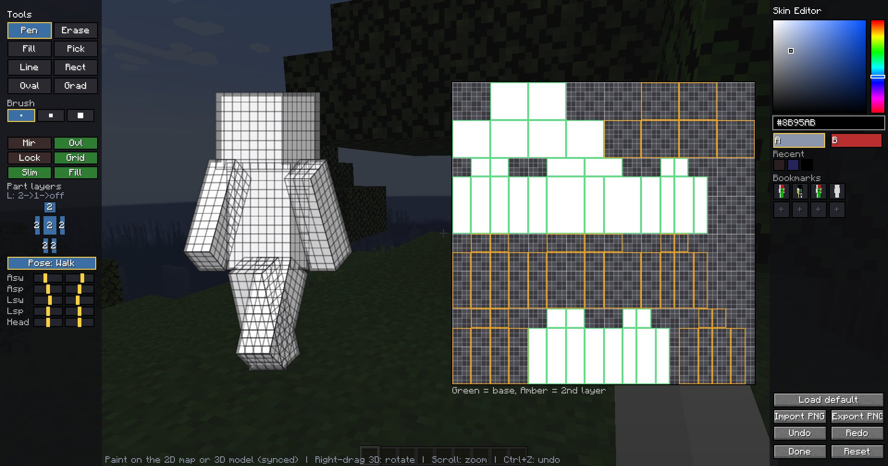

# Chameleon

**日本語** | [English](README_en.md)

マルチプレイで **自分のスキンをゲーム内でペイントできる** Minecraft Mod です。

- 対応バージョン: **Minecraft 1.20.1**
- 対応ローダー: **Forge / Fabric**（Fabric は **Fabric API** が必要）

---

## 導入

1. 対応する jar を `mods` フォルダに入れる。
   - Forge: `chameleon-forge-1.20.1-<version>.jar`
   - Fabric: `chameleon-fabric-1.20.1-<version>.jar` ＋ Fabric API
2. ゲームを起動してワールド／サーバーに入る。
3. **`K` キー**（初期設定）でスキンエディタを開く。
   - 変更したい場合は `設定 → 操作設定 → カメレオン → スキンエディタを開く` で再割り当て。

---

## エディタの使い方

エディタは **3Dモデルと2D UVマップに直接ペイントする** スタイルです。どちらに描いても即座にもう一方へ反映されます。編集は **その場で即反映**（保存ボタンはありません）。`完了` または `Esc` で閉じます。

### 基本操作

| 操作                                      | 効果                |
|-----------------------------------------|-------------------|
| 左ドラッグ（モデル/マップ上）                         | 選択中のツールで描画        |
| 右ドラッグ（3D領域）                             | モデルを回転            |
| マウスホイール                                 | ズーム（3D / 2D それぞれ） |
| `Ctrl+Z` / `Ctrl+Shift+Z`（または `Ctrl+Y`） | 元に戻す / やり直し       |

- ブラシは **面（パーツの各フェイス）の内側でクリップ** されるため、隣のパーツへはみ出しません。
- **内側（ベース）レイヤーは常に不透明で描画** されます。体が透けて見えることはありません（2層目だけ透明を使えます）。

### ツール（左パネル）

| ツール                | 効果                     |
|--------------------|------------------------|
| ペン                 | 選択色で描く                 |
| 消し                 | 透明にする（2層目のみ。ベースは透けません） |
| バケツ                | 同色領域を塗りつぶし（1フェイス内に限定）  |
| スポイト               | クリックした色を拾う             |
| 直線 / 四角 / 楕円 / グラデ | 図形ツール（ドラッグで範囲指定）       |

- **ブラシ 1/2/3** … サイズ。ボタンには太さを表す四角が表示されます。
- **鏡映** … 左右対称に同時描画。
- **2層** … 2層目（帽子・上着レイヤー）の表示マスター。
- **α固定** … 不透明な部分だけ塗り、透明部分を保護。
- **グリッド** … 1ピクセルのマス目を表示（3Dモデルにも表示）。
- **スリム** … 細腕（Alex）モデルに切替。**この slim/wide は他プレイヤーにも反映** されます。
- **塗り潰し** … 図形ツールを塗りつぶし／枠線のみで切替。

### パーツ層

人型フィギュアの各パーツを **左クリックで `2層 → 1層 → なし` と切替** できます（表示・編集対象の制御）。外側レイヤーがある時は内側の枠線を隠すなど、見やすさにも配慮しています。

### ポーズ（プレビュー専用）

3Dプレビューのポーズを変えて、塗りやすい/見栄えを確認できます。**この機能はエディタ内のプレビューだけ** で、ワールドの見た目や他人には影響しません。

- ポーズボタンでプリセット切替（立ち / T字 / 万歳 / 座り / **歩き**＝既定）。
- 下の **関節スライダー** で微調整（腕の振り・開き、脚の振り・開きを左右独立、頭の横向き・縦向き）。

### 色（右パネル）

- **HSVピッカー**（彩度/明度ボックス＋色相バー）と **`#RRGGBB`** 入力。
- **A / B スワッチ** … 2色を保持。クリックでアクティブ色を切替し、その色で描画します。
- **履歴** … 最近使った色。クリックで再選択。
- 色（A/B・履歴）は **ゲーム再起動後も保持** されます。

### ブックマーク

右パネルにスキンの **3Dサムネイル付き保存スロット** が並びます。

- 埋まった枠を **左クリック=読込**、空き枠または **右クリック=現在のスキンを保存**。
- 保存したスキンは **クライアントに永続化** され、再起動後も残ります。

### 読み込み / 書き出し

- **PNG読込** … 64×64 のスキン PNG を読み込み。**古い 64×32 スキンは自動で 64×64 に変換**（右腕・右脚を左側へミラー）。
- **PNG書出** … 現在のスキンを 64×64 PNG で保存。
- **デフォルト読込** … 自分の本来の Minecraft スキン（Mojang スキン／無ければ Steve/Alex）を **キャンバスに取り込み**、そこから編集を始められます。
- **白紙** … キャンバスを不透明な白い体にリセット。

---

## マルチプレイでの見え方

本MODはクライアント側で動くため、**どんなサーバーにも接続できます**
### **Mod が入ったサーバー（およびシングルプレイ）**
- 自分のスキンが **クライアント → サーバー → 全員** に送信され、全プレイヤーの画面で反映されます。
- 後から参加した人にも自動送信され、**サーバー再起動後も保持** されます。

### **Mod の無いサーバー**
- 他人に送信できないため、**自分のワールドの見た目は変えません**。
- この場合エディタは **「ただのエディタ」** として動作し、編集・保存だけ行えます。塗ったスキンはクライアントに保存され、次に Mod 入りサーバーへ入ったとき自動で適用・送信されます。

---

## データの保存場所

- クライアント（`.minecraft` 直下など、ゲームディレクトリ内）
  - `chameleon/self.skin` … 自分の現在のスキン
  - `chameleon/bookmarks/` … ブックマークのスロット
  - `chameleon/editor.bin` … 色（A/B・履歴）
- サーバー（ワールドセーブ内）
  - `<world>/chameleon/skins/` … 各プレイヤーのスキン（Mod 入りサーバーのみ）

---