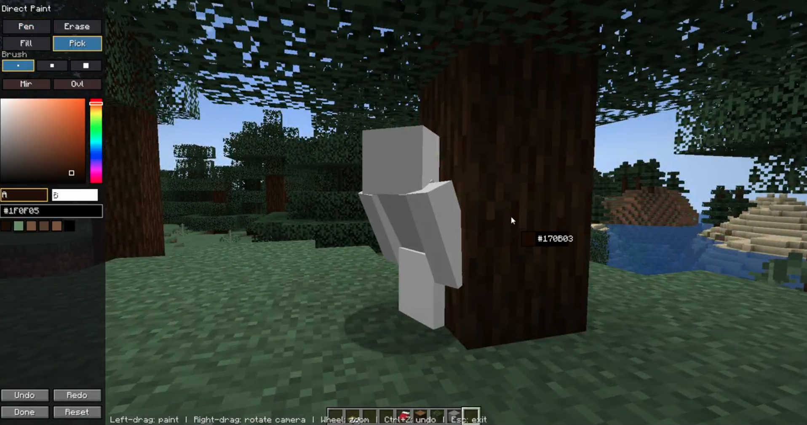

# Chameleon

[日本語](README.md) | **English**

A Minecraft mod that lets you **paint your own skin in-game** for multiplayer.
Paint your pure-white body to blend into the scenery and hide from the seeker — a "drawing mimicry" skin editor for that kind of play.

- Supported version: **Minecraft 1.20.1**
- Loaders: **Forge / Fabric** (Fabric requires **Fabric API**)

---

## Installation

1. Put the jar for your loader into the `mods` folder.
   - Forge: `chameleon-forge-1.20.1-<version>.jar`
   - Fabric: `chameleon-fabric-1.20.1-<version>.jar` + Fabric API
2. Launch the game and enter a world / server.
3. Open the skin editor with the **`K` key** (default).
   - To rebind: `Options → Controls → Chameleon → Open Skin Editor`.

---

## Using the editor

The editor lets you **paint directly on a 3D model and a 2D UV map** — drawing on either one updates the other instantly. Edits apply **immediately (there is no Save button)**. Close with `Done` or `Esc`.

### Basic controls

| Action | Effect |
|--------|--------|
| Left-drag (on the model / map) | Paint with the selected tool |
| Right-drag (3D area) | Rotate the model |
| Mouse wheel | Zoom (3D / 2D independently) |
| `Ctrl+Z` / `Ctrl+Shift+Z` (or `Ctrl+Y`) | Undo / Redo |

- Brush strokes are **clipped to the face** you paint on, so they never bleed onto an adjacent part.
- The **inner (base) layer is always rendered opaque** — your body is never see-through (only the 2nd layer can be transparent).

### Tools (left panel)

| Tool | Effect |
|------|--------|
| Pen | Paint with the selected color |
| Erase | Make transparent (2nd layer only; the base stays opaque) |
| Fill | Flood-fill a same-color area (limited to one face) |
| Eyedropper | Pick the color you click |
| Line / Rect / Oval / Gradient | Shape tools (drag to define the area) |

- **Brush 1/2/3** … size. Each button shows a square that represents the thickness.
- **Mirror** … paint symmetrically on both sides.
- **2nd layer** … master toggle for the 2nd (hat / jacket) layer.
- **Lock alpha** … paint only over opaque pixels, protecting transparent areas.
- **Grid** … show the per-pixel grid (on the 3D model too).
- **Slim** … switch to the slim (Alex) arms. **This slim/wide choice is reflected to other players too.**
- **Fill (shape)** … toggle the shape tools between filled and outline-only.

### Part layers

**Left-click** each part of the humanoid figure to cycle it `2 layers → 1 layer → off` (controls what is shown / edited). It also hides the inner outline when the outer layer is present, for readability.

### Pose (preview only)

Change the 3D preview pose to paint more easily or check the look. **This affects only the editor preview** — not your in-world appearance or other players.

- The pose button cycles presets (Idle / T-pose / Arms-up / Sit / **Walk** = default).
- The **joint sliders** below fine-tune it (arm swing & spread, leg swing & spread — independent per side — and head turn / nod).

### Colors (right panel)

- An **HSV picker** (saturation/value box + hue bar) and **`#RRGGBB`** input.
- **A / B swatches** … hold two colors. Click to switch the active one; you paint with it.
- **History** … recently used colors. Click to reuse.
- Colors (A/B and history) are **shared with the in-world paint mode (below)** and **persist across game restarts**.

### Bookmarks

The right panel has **save slots with 3D thumbnails** of each skin.

- **Left-click a filled slot = load**; an empty slot or **right-click = save the current skin**.
- Saved skins are **persisted on the client** and survive restarts.

### Import / Export

- **Import PNG** … load a 64×64 skin PNG. **Legacy 64×32 skins are auto-converted to 64×64** (the right arm/leg are mirrored to the left).
- **Export PNG** … save the current skin as a 64×64 PNG.
- **Load default** … import your real Minecraft skin (your Mojang skin, or Steve/Alex) into the canvas so you can edit from it.
- **Reset** … reset the canvas to an opaque white body.

---

## In-world direct paint (`N` key)

Separate from the editor (`K`), this mode lets you **paint directly on your real body in the world**. You paint while seeing the actual scenery and lighting, which suits "chameleon"-style blending into your surroundings.

- Open with the **`N` key** (default). It switches to third person and orbits the camera around your body.
  - To rebind: `Options → Controls → Chameleon → Paint Directly In-World`.
- You paint **in whatever pose you're currently in** (crouching, walking, etc.).

| Action | Effect |
|--------|--------|
| Left-drag (on the body) | Paint with the selected tool |
| Right-drag | Rotate the camera (orbit around you) |
| Mouse wheel | Zoom |
| `Ctrl+Z` / `Ctrl+Y` | Undo / Redo |
| `G` | Toggle the guide outline (where clicks land) |
| `Esc` | Exit |

- The left panel has the tools (Pen / Erase / Fill / Eyedropper), brush, mirror, 2nd layer, HSV picker, A/B and history.
- **The eyedropper samples the colour shown on screen** (a nearby block, etc.). It corrects for the current lighting, so the painted body blends into the surface you sampled.
- **A/B colours and history are shared with the editor (`K`)** — a colour used in one shows up in the other, and both persist across restarts.

---

## How it looks in multiplayer

Because this mod runs on the client, **you can connect to any server** (no "server mismatch" even on servers without the mod). The display behavior depends on the server, though.

### On a server that has the mod (and in singleplayer)
- Your skin is sent **client → server → everyone** and shows on every player's screen.
- Players who join later receive it automatically, and it **persists across server restarts**.

### On a server without the mod
- Since it can't be sent to others, **your in-world appearance is not changed** (to avoid looking different from everyone else).
- The editor then works as **"just an editor"** — you can edit and save. Your skin is stored on the client and is automatically applied/sent the next time you join a server that has the mod.

So your skin is **data that belongs to your client** — it follows you across restarts and between servers.

---

## Where data is stored

- Client (inside the game directory, e.g. under `.minecraft`)
  - `chameleon/self.skin` … your current skin
  - `chameleon/bookmarks/` … bookmark slots
  - `chameleon/editor.bin` … colors (A/B and history)
- Server (inside the world save)
  - `<world>/chameleon/skins/` … each player's skin (servers with the mod only)

---